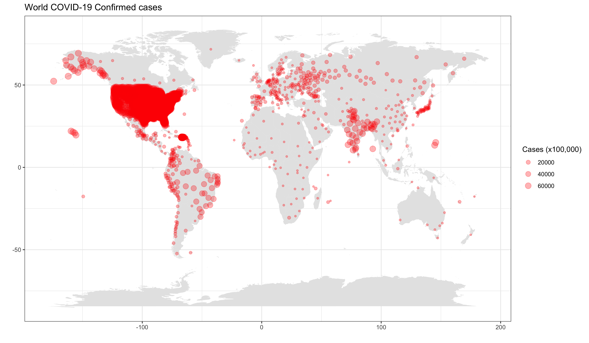

```{r setup, include=FALSE}
knitr::opts_chunk$set(echo = F)
```
##  Creating Country, State and County maps
For this lab it is important to note that the time series data does not currently have entries for US States. The daily reports include US State and more recently US country/administrative units. Is possible to concatenate the daily reports to create a time series for US States, but cognizant of changes in the formats of the daily reports.
# Building maps
```{r}
library(tidyverse)
library(maps)
# install.packages("mapdata")
library(mapdata)
library(lubridate)
library(viridis)
# install.packages("wesanderson")
library(wesanderson)
```
Here is a graph containing all the coordinate information. Note this is not summarized by country. Since there are now main points for US counties, there are many points in the US
```{r}
daily_report <- read_csv(url("https://raw.githubusercontent.com/CSSEGISandData/COVID-19/master/csse_covid_19_data/csse_covid_19_daily_reports/04-02-2020.csv")) %>% 
  rename(Long = "Long_") 

ggplot(daily_report, aes(x = Long, y = Lat, size = Confirmed/1000)) +
    borders("world", colour = NA, fill = "grey90") +
    theme_bw() +
    geom_point(shape = 21, color='purple', fill='purple', alpha = 0.5) +
    labs(title = 'World COVID-19 Confirmed cases',x = '', y = '',
        size="Cases (x1000))") +
    theme(legend.position = "right") +
    coord_fixed(ratio=1.5)
```
Zoom in on US 48 states. To do this Alaska, Hawaii and US Territories are filtered. Some US State entries have a Lat and Long of zero, so these are filtered as well.
```{r}
daily_report <- read_csv(url("https://raw.githubusercontent.com/CSSEGISandData/COVID-19/master/csse_covid_19_data/csse_covid_19_daily_reports/04-05-2020.csv")) %>% 
  rename(Long = "Long_") %>% 
  filter(Country_Region == "US") %>% 
  filter (!Province_State %in% c("Alaska","Hawaii", "American Samoa",
                  "Puerto Rico","Northern Mariana Islands", 
                  "Virgin Islands", "Recovered", "Guam", "Grand Princess",
                  "District of Columbia", "Diamond Princess")) %>% 
  filter(Lat > 0)


ggplot(daily_report, aes(x = Long, y = Lat, size = Confirmed/1000)) +
    borders("state", colour = "black", fill = "grey90") +
    theme_bw() +
    geom_point(shape = 21, color='purple', fill='purple', alpha = 0.5) +
    labs(title = 'COVID-19 Confirmed Cases in the US', x = '', y = '',
        size="Cases (x1000))") +
    theme(legend.position = "right") +
    coord_fixed(ratio=1.5)
```
Here is a prettier version based on an example by Anisa Dhana
```{r}
mybreaks <- c(1, 100, 1000, 10000, 10000)
ggplot(daily_report, aes(x = Long, y = Lat, size = Confirmed)) +
    borders("state", colour = "white", fill = "grey90") +
    geom_point(aes(x=Long, y=Lat, size=Confirmed, color=Confirmed),stroke=F, alpha=0.7) +
    scale_size_continuous(name="Cases", trans="log", range=c(1,7), 
                        breaks=mybreaks, labels = c("1-99",
                        "100-999", "1,000-9,999", "10,000-99,999", "50,000+")) +
    scale_color_viridis_c(option="viridis",name="Cases",
                        trans="log", breaks=mybreaks, labels = c("1-99",
                        "100-999", "1,000-9,999", "10,000-99,999", "50,000+"))  +
# Cleaning up the graph
  
  theme_void() + 
    guides( colour = guide_legend()) +
    labs(title = "Anisa Dhana's lagout for COVID-19 Confirmed Cases in the US'") +
    theme(
      legend.position = "bottom",
      text = element_text(color = "#22211d"),
      plot.background = element_rect(fill = "#ffffff", color = NA), 
      panel.background = element_rect(fill = "#ffffff", color = NA), 
      legend.background = element_rect(fill = "#ffffff", color = NA)
    ) +
    coord_fixed(ratio=1.5)
```
Note that in both examples the ggplot funtion borders is used to define the areas in the map
# Mapping data to shapes
```{r}
daily_report <- read_csv(url("https://raw.githubusercontent.com/CSSEGISandData/COVID-19/master/csse_covid_19_data/csse_covid_19_daily_reports/04-02-2020.csv")) %>% 
  rename(Long = "Long_") %>% 
  filter(Country_Region == "US") %>% 
  group_by(Province_State) %>% 
  summarize(Confirmed = sum(Confirmed)) %>% 
  mutate(Province_State = tolower(Province_State))
# load the US map data
us <- map_data("state")
# We need to join the us map data with our daily report to make one data frame/tibble
state_join <- left_join(us, daily_report, by = c("region" = "Province_State"))
# plot state map
```
# Using R color palattes
This is a bit of a digression back to Labs 3 and 4, but there are many R color palattes to choose from or you can create your own. In the above a simple gradient is used. The example from Anisa Dhana uses the viridis palatte which is designed to be perceived by viewers with common forms of colour blindness. Here is an example using a different color package - Wes Anderson. …and more <https://www.datanovia.com/en/blog/top-r-color-palettes-to-know-for-great-data-visualization/> 
```{r}
# plot state map
ggplot(data = us, mapping = aes(x = long, y = lat, group = group)) + 
  coord_fixed(1.3) + 
# Add data layer
  geom_polygon(data = state_join, aes(fill = Confirmed), color = "black") +
  scale_fill_gradientn(colours = 
                         wes_palette("Zissou1", 100, type = "continuous"),
                         trans = "log10") +
  labs(title = "COVID-19 Confirmed Cases in the US'")
```
A look now by the counties using the RColorBrewer
```{r}
library(RColorBrewer)
# To display only colorblind-friendly brewer palettes, specify the option colorblindFriendly = TRUE as follow:
# display.brewer.all(colorblindFriendly = TRUE)
# Get and format the covid report data
report_03_27_2020 <- read_csv(url("https://raw.githubusercontent.com/CSSEGISandData/COVID-19/master/csse_covid_19_data/csse_covid_19_daily_reports/04-02-2020.csv")) %>% 
  rename(Long = "Long_") %>% 
  unite(Key, Admin2, Province_State, sep = ".") %>% 
  group_by(Key) %>% 
  summarize(Confirmed = sum(Confirmed)) %>% 
  mutate(Key = tolower(Key))
# dim(report_03_27_2020)
# get and format the map data
us <- map_data("state")
counties <- map_data("county") %>% 
  unite(Key, subregion, region, sep = ".", remove = FALSE)
# Join the 2 tibbles
state_join <- left_join(counties, report_03_27_2020, by = c("Key"))
# sum(is.na(state_join$Confirmed))
ggplot(data = us, mapping = aes(x = long, y = lat, group = group)) + 
  coord_fixed(1.3) + 
  # Add data layer
  borders("state", colour = "black") +
  geom_polygon(data = state_join, aes(fill = Confirmed)) +
  scale_fill_gradientn(colors = brewer.pal(n = 5, name = "PuRd"),
                       breaks = c(1, 10, 100, 1000, 10000, 100000),
                       trans = "log10", na.value = "White") +
  ggtitle("Number of Confirmed Cases by US County") +
  theme_bw() 
```
If we look at just Massachusetts
```{r}
daily_report <- read_csv(url("https://raw.githubusercontent.com/CSSEGISandData/COVID-19/master/csse_covid_19_data/csse_covid_19_daily_reports/04-02-2020.csv")) %>% 
  rename(Long = "Long_") %>% 
  filter(Province_State == "Massachusetts") %>% 
  group_by(Admin2) %>% 
  summarize(Confirmed = sum(Confirmed)) %>% 
  mutate(Admin2 = tolower(Admin2))
us <- map_data("state")
ma_us <- subset(us, region == "massachusetts")
counties <- map_data("county")
ma_county <- subset(counties, region == "massachusetts")
state_join <- left_join(ma_county, daily_report, by = c("subregion" = "Admin2")) 
# plot state map
ggplot(data = ma_county, mapping = aes(x = long, y = lat, group = group)) + 
  coord_fixed(1.3) + 
# Add data layer
  geom_polygon(data = state_join, aes(fill = Confirmed), color = "white") +
    scale_fill_gradientn(colors = brewer.pal(n = 5, name = "BuGn"),
                         trans = "log10") +
  labs(title = "COVID-19 Confirmed Cases in Massachusetts'")
```
Note the cases on Nantucket and Dukes counties were reported as one value and not included on the graph. There is also an asssigned category that includes 303 Confirmed cases as of 3/31/2020.
```{r}
daily_report
```
# Interactive graphs
In Lab 5 plotly was introduced. It is a great simple way to make interactive graphs with the maps
```{r}
library(plotly)
ggplotly(
  ggplot(data = ma_county, mapping = aes(x = long, y = lat, group = group)) + 
  coord_fixed(1.3) + 
# Add data layer
  geom_polygon(data = state_join, aes(fill = Confirmed), color = "black") +
    scale_fill_gradientn(colours = 
                         wes_palette("Zissou1", 100, type = "continuous")) +
  ggtitle("COVID-19 Cases in MA") +
# Cleaning up the graph
  labs(x=NULL, y=NULL) +
  theme(panel.border = element_blank()) +
  theme(panel.background = element_blank()) +
  theme(axis.ticks = element_blank()) +
  theme(axis.text = element_blank())
)
```
# World Map example 
```{r}
 # Read in the daily report
daily_report <- read_csv(url("https://raw.githubusercontent.com/CSSEGISandData/COVID-19/master/csse_covid_19_data/csse_covid_19_daily_reports/09-26-2020.csv")) %>% 
  rename(Long = "Long_") %>% 
  group_by(Country_Region) %>% 
  summarize(Confirmed = sum(Confirmed), Deaths = sum(Deaths))

# Read in the world map data
world <- as_tibble(map_data("world"))

# Check to see if there are differences in the naming of countries
setdiff(world$region, daily_report$Country_Region) 
```
```{r}
# Many of these countries are considered states or territories in the JHU covid reports,
# but let's fix a few of them

world <- as_tibble(map_data("world")) %>% 
 mutate(region = str_replace_all(region, c("USA" = "US", "Czech Republic" = "Czechia",  
        "Ivory Coast" = "Cote d'Ivoire", "Democratic Republic of the Congo" = "Congo (Kinshasa)", 
        "Republic of Congo" = "Congo (Brazzaville)")))

# Join the covid report with the map data
country_join <- left_join(world, daily_report, by = c("region" = "Country_Region"))

# Create the graph
library(wesanderson)
ggplot(data = world, mapping = aes(x = long, y = lat, text = region, group = group)) + 
  coord_fixed(1.3) + 
# Add data layer
  geom_polygon(data = country_join, aes(fill = Deaths), color = "black") +
  scale_fill_gradientn(colours = 
                         wes_palette("Zissou1", 100, type = "continuous")) +
  labs(title = "COVID-19 Deaths'")
```


# Exercises

### 1. For the above graph “World COVID-19 Confirmed case” summarize the counts for each Country on the graph and update the graph to 9/26/2020. You may need to adjust the size of the points.

import case data from 9/26/20
```{r}
report_09_26_2020 <- read_csv(url("https://raw.githubusercontent.com/CSSEGISandData/COVID-19/master/csse_covid_19_data/csse_covid_19_daily_reports/09-26-2020.csv")) %>% 
  rename(Long = "Long_") %>%
  group_by(Country_Region) %>%
  summarize(Confirmed = sum(Confirmed), Lat, Long)

# Lat = mean(Lat), Long = mean(Long)
head(report_09_26_2020)
```

```{r}
ggplot(report_09_26_2020, aes(x = Long, y = Lat, size = Confirmed/100,000)) +
    borders("world", colour = NA, fill = "grey90") +
    theme_bw() +
    geom_point(shape = 21, color='red', fill='red', alpha = 0.3) +
    scale_size_continuous(name = "Cases (x100,000)", range = c(1,4)) +
    labs(title = 'World COVID-19 Confirmed cases',x = '', y = '') +
    theme(legend.position = "right")

```

save file 
```{r}
ggsave("world_cases_map.png", width = 12)
```

 

### 2. Update Anisa Dhana’s graph layout of the US to 9/26/2020. You may need to adjust the size of the points.

```{r}
US_report_09_26_2020 <- read_csv(url("https://raw.githubusercontent.com/CSSEGISandData/COVID-19/master/csse_covid_19_data/csse_covid_19_daily_reports/09-26-2020.csv")) %>% 
  rename(Long = "Long_") %>%
  filter(Country_Region == "US") %>%
  filter (!Province_State %in% c("Alaska","Hawaii", "American Samoa",
                  "Puerto Rico","Northern Mariana Islands", 
                  "Virgin Islands", "Recovered", "Guam", "Grand Princess",
                  "District of Columbia", "Diamond Princess")) %>% 
   filter(Lat > 0)

head(US_report_09_26_2020)
```

Plot of COVID-19 Confirmed Cases in the US
```{r}
ggplot(US_report_09_26_2020, aes(x = Long, y = Lat, size = Confirmed/1000)) +
    borders("state", colour = "black", fill = "grey90") +
    theme_bw() +
    geom_point(shape = 21, color='purple', fill='purple', alpha = 0.5) +
    labs(title = 'COVID-19 Confirmed Cases in the US', x = '', y = '',
        size="Cases (x1000))") +
    theme(legend.position = "right") +
    coord_fixed(ratio=1.5)
```
Updated Anisa Dhana’s graph for US Cases as of 9/26/2020
```{r}
mybreaks <- c(1, 1000, 10000, 100000, 100000, 1000000, 10000000)

ggplot(US_report_09_26_2020, aes(x = Long, y = Lat, size = Confirmed)) +
    borders("state", colour = "white", fill = "grey90") +
    geom_point(aes(x = Long, y = Lat, size = Confirmed, color = Confirmed), stroke=F, alpha=0.5) +
    scale_size_continuous(name = "Cases", range = c(1, 18), 
                        breaks = mybreaks, labels = c("1-999", "100-9999","10,000-999,999", "10,000-99,999", "100,000-1,000,000", "1,000,000-10,000,000", "10,000,000+")) +
    scale_color_viridis_c(option = "cividis", name = "Cases", 
                          breaks = mybreaks, labels = c("1-999", "100-9999","10,000-999,999", "10,000-99,999", "100,000-1,000,000", "1,000,000-10,000,000", "10,000,000+")) +
# Cleaning up the graph
  
  theme_void() + 
    guides( colour = guide_legend()) +
    labs(title = "Anisa Dhana's lagout for COVID-19 Confirmed Cases in the US") +
    theme(
      legend.position = "bottom",
      text = element_text(color = "#22211d"),
      plot.background = element_rect(fill = "#ffffff", color = NA), 
      panel.background = element_rect(fill = "#ffffff", color = NA), 
      legend.background = element_rect(fill = "#ffffff", color = NA)
    ) +
    coord_fixed(ratio=1.5)
```
### 3. Update the above graph “Number of Confirmed Cases by US County” to 9/26/2020 and use a different color scheme or theme
```{r}
library(RColorBrewer)
# To display only colorblind-friendly brewer palettes, specify the option colorblindFriendly = TRUE as follow:
# display.brewer.all(colorblindFriendly = TRUE)
# Get and format the covid report data
report_09_26_2020 <- read_csv(url("https://raw.githubusercontent.com/CSSEGISandData/COVID-19/master/csse_covid_19_data/csse_covid_19_daily_reports/09-26-2020.csv")) %>% 
  rename(Long = "Long_") %>% 
  unite(Key, Admin2, Province_State, sep = ".") %>% 
  group_by(Key) %>% 
  summarize(Confirmeds = sum(Confirmed)) %>% 
  mutate(Key = tolower(Key))
```
get and format the map data
```{r}
us <- map_data("state")
counties <- map_data("county") %>% 
  unite(Key, subregion, region, sep = ".", remove = FALSE)
# Join the 2 tibbles
state_join <- left_join(counties, report_09_26_2020, by = c("Key"))

# sum(is.na(state_join$Confirmed))
```

```{r}
ggplot(data = us, mapping = aes(x = long, y = lat, group = group)) + 
  coord_fixed(1.3) + 
  # Add data layer
  borders("state", colour = "black") +
  geom_polygon(data = state_join, aes(fill = Confirmed)) +
  scale_fill_gradientn(colors = brewer.pal(n = 10, name = "OrRd"),
                       breaks = c(1, 10, 100, 1000, 10000, 100000),
                       trans = "log10", na.value = "White") +
  ggtitle("Number of Confirmed Cases by US County") +
  theme_bw() 
```
### 4. Make an interactive plot using a state of your chosing using a theme different from used in the above exammples.

```{r}
TX_daily_report <- read_csv(url("https://raw.githubusercontent.com/CSSEGISandData/COVID-19/master/csse_covid_19_data/csse_covid_19_daily_reports/09-26-2020.csv")) %>% 
  rename(Long = "Long_") %>% 
  filter(Province_State == "Texas") %>% 
  group_by(Admin2) %>% 
  summarize(Confirmed = sum(Confirmed)) %>% 
  mutate(Admin2 = tolower(Admin2))

us <- map_data("state")

tx_us <- subset(us, region == "texas")

counties <- map_data("county")

tx_county <- subset(counties, region == "texas")

state_join <- left_join(tx_county, TX_daily_report, by = c("subregion" = "Admin2"))
```
Plot state map 
```{r}
ggplot(data = tx_county, mapping = aes(x = long, y = lat, group = group)) + 
  coord_fixed(1.3) + 
# Add data layer
  geom_polygon(data = state_join, aes(fill = Confirmed), color = "white") +
    scale_fill_gradientn(colors = brewer.pal(n = 8, name = "Spectral"),
                         trans = "log10") +
  labs(title = "COVID-19 Confirmed Cases in Texas",
       x = "", 
       y = "")
```
Interactive version of TX graph 
```{r}
library(plotly)
ggplotly(
  ggplot(data = tx_county, mapping = aes(x = long, y = lat, group = group)) + 
  coord_fixed(1.3) + 
# Add data layer
  geom_polygon(data = state_join, aes(fill = Confirmed), color = "black") +
    scale_fill_gradientn(colours = wes_palette("Chevalier1", type = "continuous")) +
  ggtitle("COVID-19 Cases in TX") +
# Cleaning up the graph
  labs(x=NULL, y=NULL) +
  theme(panel.border = element_blank()) +
  theme(panel.background = element_blank()) +
  theme(axis.ticks = element_blank()) +
  theme(axis.text = element_blank())
)
```


Application written in R [@RCoreTeam] using the Shiny framework [@Chang2015].

# References 