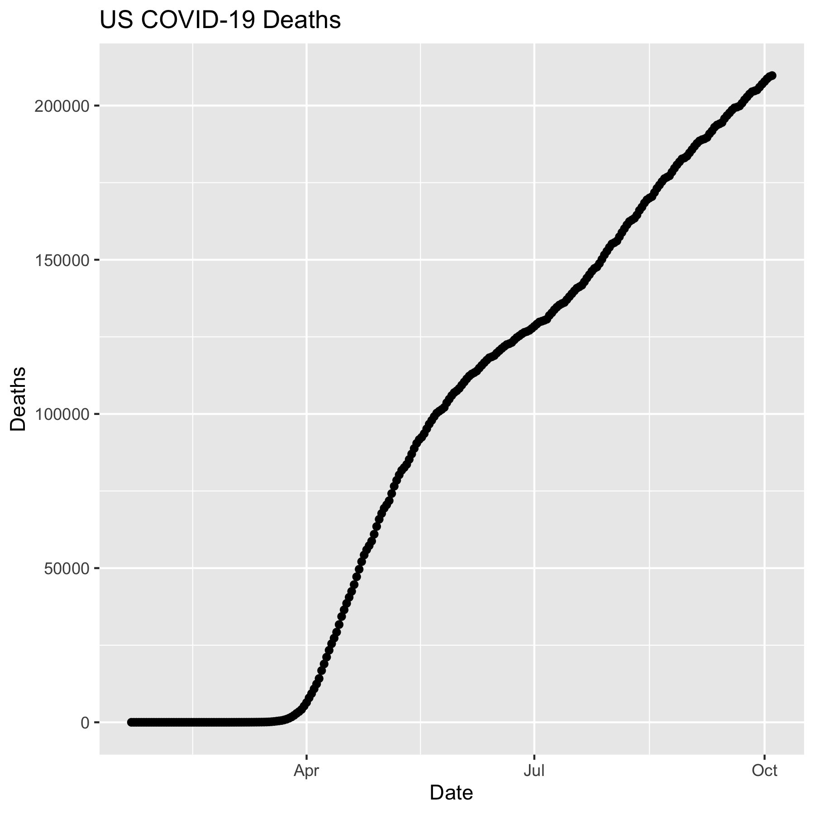
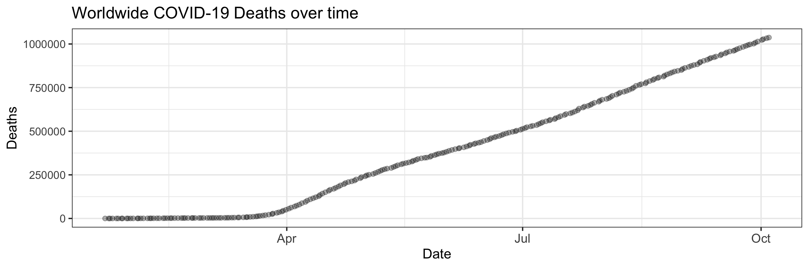

```{r setup, include=FALSE}
knitr::opts_chunk$set(echo = F)
```
# Data for the lab
Let’s start by loading libraries
```{r echo=TRUE, message=FALSE, warning=FALSE}
library(tidyverse)
library(lubridate)
library(plotly)
library(gganimate)
library(transformr)
```
Load the JHU time series data to work with below
```{r echo=TRUE, message=FALSE, warning=FALSE}
time_series_confirmed_long <- read_csv(url("https://raw.githubusercontent.com/CSSEGISandData/COVID-19/master/csse_covid_19_data/csse_covid_19_time_series/time_series_covid19_confirmed_global.csv")) %>%
  rename(Province_State = "Province/State", Country_Region = "Country/Region")  %>% 
               pivot_longer(-c(Province_State, Country_Region, Lat, Long),
                             names_to = "Date", values_to = "Confirmed") 
```
Let's get the times series data for deaths
```{r echo=TRUE, message=FALSE, warning=FALSE}
time_series_deaths_long <- read_csv(url("https://raw.githubusercontent.com/CSSEGISandData/COVID-19/master/csse_covid_19_data/csse_covid_19_time_series/time_series_covid19_deaths_global.csv")) %>%
  rename(Province_State = "Province/State", Country_Region = "Country/Region")  %>% 
  pivot_longer(-c(Province_State, Country_Region, Lat, Long),
               names_to = "Date", values_to = "Deaths")
```
Create Keys 
```{r echo=TRUE, message=FALSE, warning=FALSE}
time_series_confirmed_long <- time_series_confirmed_long %>% 
  unite(Key, Province_State, Country_Region, Date, sep = ".", remove = FALSE)
time_series_deaths_long <- time_series_deaths_long %>% 
  unite(Key, Province_State, Country_Region, Date, sep = ".") %>% 
  select(Key, Deaths)
```
Join tables
```{r echo=TRUE, message=FALSE, warning=FALSE}
time_series_long_joined <- full_join(time_series_confirmed_long,
    time_series_deaths_long, by = c("Key")) %>% 
    select(-Key)
```
Reformat the data
```{r echo=TRUE, message=FALSE, warning=FALSE}
time_series_long_joined$Date <- mdy(time_series_long_joined$Date)
```
Create Report table with counts
```{r echo=TRUE, message=FALSE, warning=FALSE}
time_series_long_joined_counts <- time_series_long_joined %>% 
  pivot_longer(-c(Province_State, Country_Region, Lat, Long, Date),
               names_to = "Report_Type", values_to = "Counts")
```

# Controlling graph size in RMarkdown

In the opening line of the RMarkdown code chunk {r} you can control the output of the code, graphs, tables using knitr syntax. For example if {r, eval = FALSE} the code will not be run, but will be shown. If {r, code = FALSE} the code will not be shown, but will be run and the output will be shown (useful in reports where the reader is only interested in the results/graphs, but not the code). You can also suppress error messages and warnings so that the reader isn’t bothered by them (but you should take notice).

The dimensions of an individual graph in the RMarkdown document be adjusted by specifying the graph dimensions {r, fig.width = 6, fig.height = 6}

# Graphic Output

You may have realized that you can export plots in R Studio by clicking on Export in the Plots window that appears after you make a graph. You can save as a pdf, svg, tiff, png, bmp, jpeg and eps. You can also write the output directly to a file. This is particularly useful for controling the final dimensions in a reproducible way and for manuscripts.
```{r echo=TRUE, message=FALSE, warning=FALSE}
# Plot graph to a pdf outputfile
pdf("images/time_series_example_plot.pdf", width=6, height=3)

time_series_long_joined %>% 
  group_by(Country_Region,Date) %>% 
  summarise_at(c("Confirmed", "Deaths"), sum) %>% 
  filter (Country_Region == "US") %>% 
    ggplot(aes(x = Date,  y = Deaths)) + 
    geom_point() +
    geom_line() +
    ggtitle("US COVID-19 Deaths")

dev.off()
```

```{r echo=FALSE, message=FALSE, warning=FALSE}
# Plot graph to a png outputfile
ppi <- 300
png("images/time_series_example_plot.png", width=6*ppi, height=6*ppi, res=ppi)
US_covid_death <- time_series_long_joined %>% 
  group_by(Country_Region,Date) %>% 
  summarise_at(c("Confirmed", "Deaths"), sum) %>% 
  filter (Country_Region == "US") %>% 
    ggplot(aes(x = Date,  y = Deaths)) + 
    geom_point() +
    geom_line() +
    ggtitle("US COVID-19 Deaths")

#dev.off()
ggsave("US-COVID-19-Deaths.png", plot = US_covid_death)
```



# RMarkdown loading images

This is the RMarkdown style for inserting images
Your image must be in your working directory
This command is put OUTSIDE the r code chunk

     

This is an alternative way using html. 
Remember that it must be in your working directory or you will need to specify the full path.
The html is put OUTSIDE the r code chunk.

    

Another way to present a graph without the code is adding echo = FALSE within the r{} chunk - {r echo = FALSE}. This prevents code, but not the results from appearing in the knitr file.

# Interactive graphs

With plotly/ggplotly (https://plot.ly/ggplot2/) you can make interactive graphs in your lab report.

There are two common formats used in graphing that you may come across in examples. One very common format that we have not used to date is putting your graph into a variable and then plotting the variable. They both work perfectly fine.
```{r echo=TRUE, message=FALSE, warning=FALSE}
ggplotly(
  time_series_long_joined %>% 
    group_by(Country_Region,Date) %>% 
    summarise_at(c("Confirmed", "Deaths"), sum) %>% 
    filter (Country_Region == "US") %>% 
    ggplot(aes(x = Date,  y = Deaths)) + 
      geom_point() +
      geom_line() +
      ggtitle("US COVID-19 Deaths")
 )
```

```{r echo=TRUE, message=FALSE, warning=FALSE}
US_deaths <- time_series_long_joined %>% 
    group_by(Country_Region,Date) %>% 
    summarise_at(c("Confirmed", "Deaths"), sum) %>% 
    filter (Country_Region == "US")
 p <- ggplot(data = US_deaths, aes(x = Date,  y = Deaths)) + 
        geom_point() +
        geom_line() +
        ggtitle("US COVID-19 Deaths")
ggplotly(p)

```

# Animated Graphs with gganimate

Animated graphs when done right have a great visual impact. You can do this in R and have your animations embedded on your web page. Essentially gganimate creates a series of files that are encompassed in a gif file. In addition to having this gif as part of your report file, you can save the gif and use in a slide or other presentations. It just takes a few lines of code to covert and existing ggplot graph into an animation.

This are some important gganimate functions:

    __transition_*()__ defines how the data should be spread out and how it relates to itself across time.
    __view_*()__ defines how the positional scales should change along the animation.
    __shadow_*()__ defines how data from other points in time should be presented in the given point in time.
    enter_()/exit_() defines how new data should appear and how old data should disappear during the course of the animation.
    ease_aes() defines how different aesthetics should be eased during transitions.
    
# Creating the animations

Below are the packages I installed. There may be others that you need, in particular to rendering gifs. Several people needed to install the packages gifski and av Some of the examples may take several minutes to create the animation.
```{r echo=TRUE, message=FALSE, warning=FALSE}
theme_set(theme_bw())
```
An animation of the confirmed cases in select countries

```{r echo=TRUE, message=FALSE, warning=FALSE}
data_time <- time_series_long_joined %>% 
    group_by(Country_Region,Date) %>% 
    summarise_at(c("Confirmed", "Deaths"), sum) %>% 
    filter (Country_Region %in% c("China","Korea, South","Japan","Italy","US")) 
p <- ggplot(data_time, aes(x = Date,  y = Confirmed, color = Country_Region)) + 
      geom_point() +
      geom_line() +
      ggtitle("Confirmed COVID-19 Cases") +
      geom_point(aes(group = seq_along(Date))) +
      transition_reveal(Date) 
# Some people needed to use this line instead
# animate(p,renderer = gifski_renderer(), end_pause = 15)
animate(p, end_pause = 15)
```

# Exercises

### Challenge 1: Print a graph (different from the one above) to a png file using 3*ppi for the height and width and display the png file in the report using the above R Markdown format.

```{r echo=TRUE, message=FALSE, warning=FALSE}
# Plot graph to a png outputfile
ppi <- 300
#make the file 
png(filename = "images/WorldWide_COVID-19_Death.png", width = 3*ppi, height = 3*ppi, res = ppi)

worldwide_death <- time_series_long_joined %>% 
  group_by(Date) %>% 
  summarise_at(c("Deaths"), sum) %>% 
    ggplot(aes(x = Date,  y = Deaths)) + 
    geom_jitter(alpha = 0.3) +
    ggtitle("Worldwide COVID-19 Deaths over time") +
  theme(axis.text.x = element_text(size =10, angle = 0)) 

ggsave("worldwide_death.png", plot = worldwide_death, path = "/Users/margarethilliard/Desktop/Evolutionary_Genomics/genomics-course/images", width = 9)

```
 

### Challenge 2: Turn one of the exercises from Lab 5 into an interactive graph with plotyly
```{r echo=TRUE, message=FALSE, warning=FALSE}
# read in and subset data 
time_series_deaths <- read_csv("data/time_series_covid19_deaths_global.csv")%>%
  rename(Province_State = "Province/State", Country_Region = "Country/Region") %>% 
  pivot_longer(-c(Province_State, Country_Region, Lat, Long),
               names_to = "Date", values_to = "Deaths") %>%
  group_by(Country_Region) %>% #data by country
  summarise(sum_death = sum(Deaths)) %>%
  arrange(desc(sum_death)) %>% # most death to least
  slice(c(1:10)) # take only the top 10
  
# plot countries with highest deaths 
death_plot <- ggplot(data = time_series_deaths, mapping = aes(x = Country_Region, y = sum_death)) +
  geom_bar(stat = "identity") +
  labs(title = "Countries with Highest COVID-19 Deaths",
       x = "Country",
       y = "Total Death") 

death_plot
```

```{r echo=TRUE, message=FALSE, warning=FALSE}
ggplotly(death_plot)
```

### Challenge 3: Create an animated graph of your choosing using the time series data to display an aspect (e.g. states or countries) of the data that is important to you.

Subset only Texas cases 
```{r echo=TRUE, message=FALSE, warning=FALSE}
Texas <- read_csv(url("https://raw.githubusercontent.com/CSSEGISandData/COVID-19/master/csse_covid_19_data/csse_covid_19_time_series/time_series_covid19_confirmed_US.csv"))%>% 
  pivot_longer(-c(UID, iso2,iso3, code3, FIPS, Admin2, Lat, Long_, Combined_Key, Province_State, Country_Region, Lat, Long_),
               names_to = c("Date"), values_to = c("Confirmed")) %>%
  filter(Province_State == c("Texas")) %>% 
  select(Province_State, Confirmed, Date) %>%
  group_by(Date, Province_State) %>%
  summarise_at(c("Confirmed"), sum) 

Texas$Date <- mdy(Texas$Date)
```
Mass cases 
```{r echo=TRUE, message=FALSE, warning=FALSE}
Mass <- read_csv(url("https://raw.githubusercontent.com/CSSEGISandData/COVID-19/master/csse_covid_19_data/csse_covid_19_time_series/time_series_covid19_confirmed_US.csv"))%>% 
  pivot_longer(-c(UID, iso2,iso3, code3, FIPS, Admin2, Lat, Long_, Combined_Key, Province_State, Country_Region, Lat, Long_),
               names_to = c("Date"), values_to = c("Confirmed")) %>%
  filter(Province_State == c("Massachusetts")) %>% 
  select(Province_State, Confirmed, Date) %>%
  group_by(Date, Province_State) %>%
  summarise_at(c("Confirmed"), sum) 

Mass$Date <- mdy(Mass$Date)
```
Vermont cases 
```{r echo=TRUE, message=FALSE, warning=FALSE}
Vermt <- read_csv(url("https://raw.githubusercontent.com/CSSEGISandData/COVID-19/master/csse_covid_19_data/csse_covid_19_time_series/time_series_covid19_confirmed_US.csv"))%>% 
  pivot_longer(-c(UID, iso2,iso3, code3, FIPS, Admin2, Lat, Long_, Combined_Key, Province_State, Country_Region, Lat, Long_),
               names_to = c("Date"), values_to = c("Confirmed")) %>%
  filter(Province_State == c("Vermont")) %>% 
  select(Province_State, Confirmed, Date) %>%
  group_by(Date, Province_State) %>%
  summarise_at(c("Confirmed"), sum) 

Vermt$Date <- mdy(Vermt$Date)
```
Plot over time to compare 
```{r echo=TRUE, message=FALSE, warning=FALSE}
ggplot(data = Mass, mapping = aes(x = Date, y = Confirmed)) +
  geom_point(size = 1, aes(color = "Massachusetts"), show.legend = TRUE) + # move "color" inside aes() to show legend
  geom_point(data = Texas, size = 1, aes(col = "Texas"), show.legend = TRUE) +
  geom_point(data = Vermt, size = 1, aes(col = "Vermont"), show.legend = TRUE) +
  labs(title = "COVID-19 Cases in MA, TX, & VT", 
       x = "Date",
       y = "Confirmed Cases", 
       col = "States") 
```

Application written in R [@RCoreTeam] using the Shiny framework [@Chang2015] and the COVID-19 Data Repository by the Center for Systems Science and Engineering (CSSE) at Johns Hopkins University [@Dong2020]. 

# References 