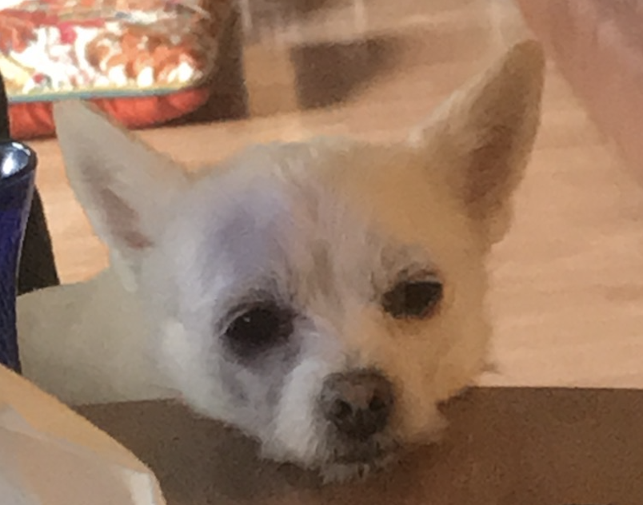

```{r setup, include=FALSE}
knitr::opts_chunk$set(echo = TRUE)
```

*** 

## lab reports:
>- [Lab 1 : Introduction to R and Reproducible Research](lab1_Hilliard.html)
>- [Lab 2 : git, GitHub and Rstudio projects](lab2.html)
>- [Lab 3A : Data Wrangling Part 1 - Starting with the Data](Lab3A.html)
>- [Lab 3B : Data Wrangling Part 2 - Manipulating Data](Lab3B.html)
>- [Lab 4 : Data wrangling and graphing COVID-19 reporting data (Part 1)](Lab4.html)
>- [Lab 4A: Data visualization with ggplot2](Lab4a.html)
>- [Lab 5 : Data wrangling and graphing COVID-19 reporting data (Part 2)](lab5.html)
>- [Lab 5A: Interactive Graphs and Animations from the COVID-19 reporting data](Lab-5-extra.html)
>- [Lab 6 : Data Maps and Interactive Graphs from the COVID-19 reporting data](Lab-6.html)
>- [Lab 7: RNA-Seq workflow: gene-level exploratory analysis and differential expression](lab7.html)
>- [Lab 8: Sequence Alignment, Phylogenetic Analysis and Tree Visualization](lab8.html)
>- [Lab 9: Programming in R - Regular Expressions](lab9.html)
>- [Lab 9A: Programming in R - Control Structures and Functions](Lab_9A.html)
>- [Lab 10: Population genomics based on high throughput sequencing (HTS)](Lab10.html)

*** 

## dog tax:

 

this is Skippy



she's a chihuahua mix 


taking a tiny nap 