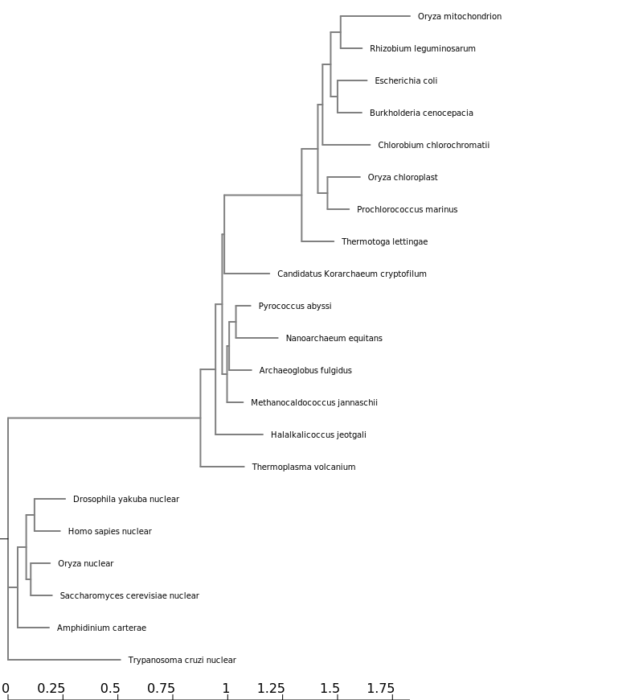

```{r setup, include=FALSE}
knitr::opts_chunk$set(echo = TRUE)
```

# NGPhylogeny.fr - A quick and easy working flow including multiple sequence alignment, phylogenetic analysis and tree visualization

Doing a phylogenetic analysis involves (1) assembling a group of sequences to evaluate, (2) aligning the sequences so that a distance can be calculate between the sequences, (3) determining the relationships among the sequences, and (4) visualizing the relationships. Step 1 was accomplished above by getting representative archaeal, bacterial and eukaryotic sequences from GenBank. Steps 2-4 will be done on web server that has been set up to run these steps at the same time. 

<https://ngphylogeny.fr>

Paste in all of the core sequences. Then click submit. This will start the analysis process. The numbers of the tree represent statistical support for the relationship. The more robust the relationship the closer the value will be to 1. The scale at the bottom represents sequence distance (e.g. 0.2 is 20%).

## Exercise 1

Use NGPhylogeny.fr to analysis the set of rRNA sequence provided.
Here is an image of the default output tree.



# Phylogenetic Analysis (tree building) on CIPRES

The CIPRES Science Gateway is a public resource for inference of large phylogenetic trees. It is designed to provide researchers with access to large computational resources of the NSF TeraGrid through a simple browser interface. The CIPRES Science Gateway The CIPRES Portal V 1.0 permitted users to run popular sequence alignment tools ClustalW, Muscle and MAFFT and the community tree inference tools FasttreeML, GARLI, RAxML, PAUP, and MrBayes.

<https://www.phylo.org/portal2/tools.action> 

## Exercise 2 

Align and do phylogenetic analysis off the sequences in CIPRES using MAFFT and FastTreeMP (we will use this tree in a later exercise)

# Visualizing and Annotating Phylogenetic Trees with R+ggtree

ggtree is an R package that extends ggplot2 for visualizating and annotating phylogenetic trees with their covariates and other associated data. 

```{r warning=FALSE, message=FALSE}
library(tidyverse)
library(ggtree)
library(treeio)
library(ggimage)
```

## Tree Import

Most tree viewer software (including R packages) focus on Newick and Nexus file formats, and other evolution analysis software might also contain supporting evidence within the file that are ready for annotating a phylogenetic tree. ggtree supports several file formats, including:

    Newick
    Nexus
    Phylip
    Jplace
    New Hampshire eXtended format (NHX)

and software output from:

    BEAST
    EPA
    HYPHY
    PAML
    PHYLDOG
    pplacer
    r8s
    RAxML
    RevBayes

The ggtree package implement several parser functions, including:

    read.tree for reading Newick files.
    read.phylip for reading Phylip files.
    read.jplace for reading Jplace files.
    read.nhx for reading NHX files.
    read.beast for parsing output of BEAST
    read.codeml for parsing output of CODEML (rst and mlc files)
    read.codeml_mlc for parsing mlc file (output of CODEML)
    read.hyphy for parsing output of HYPHY
    read.jplace for parsing jplace file including output from EPA and pplacer
    read.nhx for parsing NHX file including output from PHYLODOG and RevBayes
    read.paml_rst for parsing rst file (output of BASEML and CODEML)
    read.r8s for parsing output of r8s
    read.raxml for parsing output of RAxML

## Basic trees

Let’s first import our example tree data. We’re going to work with a made-up phylogeny with 13 samples (“tips”). Import the tree using read.tree(). Displaying the object itself really isn’t useful. The output just tells you a little bit about the tree itself.

```{r warning=FALSE}
tree <- read.tree("data/tree_newick.nwk")
```

Just like with ggplot2 we created a basic canvas with ggplot(...) and added layers with +geom_???(), we can do the same here. The ggtree package gives us a geom_tree() function. Because ggtree is built on top of ggplot2, you get ggplot2’s default gray theme with white lines. You can override this with a theme from the ggtree package.

Because you’ll almost always want to add a tree geom and remove the default background and axes, the ggtree() function is essentially a shortcut for ggplot(...) + geom_tree() + theme_tree().

```{r warning=FALSE}
# build a ggplot with a geom_tree
ggplot(tree) + geom_tree() + theme_tree()
# This is convenient shorthand
ggtree(tree)
```

There’s also the treescale geom, which adds a scale bar, or alternatively, you can change the default ggtree() theme to theme_tree2(), which adds a scale on the x-axis. The horizontal dimension in this plot shows the amount of genetic change, and the branches and represent evolutionary lineages changing over time. The longer the branch in the horizonal dimension, the larger the amount of change, and the scale tells you this. The units of branch length are usually nucleotide substitutions per site – that is, the number of changes or substitutions divided by the length of the sequence (alternatively, it could represent the percent change, i.e., the number of changes per 100 bases). 

```{r}
# add a scale
ggtree(tree) + geom_treescale()
# or add the entire scale to the x axis with theme_tree2()
ggtree(tree) + theme_tree2()
```

The default is to plot a phylogram, where the x-axis shows the genetic change / evolutionary distance. If you want to disable scaling and produce a cladogram instead, set the branch.length="none" option inside the ggtree() call. See ?ggtree for more.

```{r}
ggtree(tree, branch.length="none")
```

The ... option in the help for ?ggtree represents additional options that are further passed to ggplot(). You can use this to change aesthetics of the plot. Let’s draw a cladogram (no branch scaling) using thick blue dotted lines (note that I’m not mapping these aesthetics to features of the data with aes() – we’ll get to that later).

```{r}
ggtree(tree, branch.length="none", color="blue", size=2, linetype=3)
```


### Exercise 1

Look at the help again for ?ggtree, specifically at the layout= option. By default, it produces a rectangular layout.

    Create a slanted phylogenetic tree.
    Create a circular phylogenetic tree.
    Create a circular unscaled cladogram with thick red lines.
    
```{r}
?ggtree
```

options include: 'rectangular', 'slanted', 'fan', 'circular', 'radial', 'equal_angle' or 'daylight'

```{r}
# slanted tree 
ggtree(tree, branch.length="none", layout = 'slanted') + geom_treescale()
# circular tree 
ggtree(tree, branch.length="none", layout = 'circular') + geom_treescale()
# circular, unscaled cladogram with thick red lines 
ggtree(tree, branch.length="none", layout = 'circular', color="red", size=3, linetype=1)
```

## Other tree geoms

As we did in the ggplot2 lesson, we can create a plot object, e.g., p, to store the basic layout of a ggplot, and add more layers to it as we desire. Let’s add node and tip points. Let’s finally label the tips.

```{r}
# create the basic plot
p <- ggtree(tree)
# add node points
p + geom_nodepoint()
# add tip points
p + geom_tippoint()
# Label the tips
p + geom_tiplab()
```

### Exercise 2

Similar to how we change the aesthetics for the tree inside the ggtree() call, we can also change the aesthetics of the points themselves by passing graphical parameters inside the geom_nodepoint() or geom_tippoint() calls. Create a phylogeny with the following aesthetic characteristics:

    tips labeled in purple
    purple-colored diamond-shape tip points (hint: Google search “R point characters”) 23 
    large semitransparent yellow node points (hint: alpha=)
    Add a title with + ggtitle(...)
    
```{r}
p + geom_tiplab(col= "purple") + geom_tippoint(col= "purple", shape= 18, size=2) + geom_nodepoint(col= "goldenrod", alpha = 0.5, size = 5) + ggtitle("Exercise 2 Tree")
```

## Tree annotation

The geom_tiplab() function adds some very rudimentary annotation. Let’s take annotation a bit further. 

### Internal node number

Before we can go further we need to understand how ggtree is handling the tree structure internally. Some of the functions in ggtree for annotating clades need a parameter specifying the internal node number. To get the internal node number, user can use geom_text to display it, where the label is an aesthetic mapping to the “node variable” stored inside the tree object (think of this like the continent variable inside the gapminder object). We also supply the hjust option so that the labels aren’t sitting right on top of the nodes. 

```{r}
ggtree(tree) + geom_text(aes(label=node), hjust=-.3)
```

Another way to get the internal node number is using MRCA() function by providing a vector of taxa names (created using c("taxon1", "taxon2")).. The function will return node number of input taxa’s most recent commond ancestor (MRCA). First, re-create the plot so you can choose which taxa you want to grab the MRCA from.

```{r}
ggtree(tree) + geom_tiplab()
```

Let’s grab the most recent common ancestor for taxa C+E, and taxa G+H. We can use MRCA() to get the internal node numbers. Go back to the node-labeled plot from before to confirm this.

```{r}
MRCA(tree, c("C", "E"))
MRCA(tree, c("G", "H"))
```

## Labeling clades

We can use geom_cladelabel() to add another geom layer to annotate a selected clade with a bar indicating the clade with a corresponding label. You select the clades using the internal node number for the node that connects all the taxa in that clade. Let’s annotate the clade with the most recent common ancestor between taxa C and E (internal node 17). Let’s make the annotation red. See ?geom_cladelabel help for more.

```{r}
ggtree(tree) + 
  geom_cladelabel(node=17, label="Some random clade", color="red")
```


Let’s add back in the tip labels. Notice how now the clade label is too close to the tip labels. Let’s add an offset to adjust the position. You might have to fiddle with this number to get it looking right.
```{r fig.width= 5}
ggtree(tree) + 
  geom_tiplab() + 
  geom_cladelabel(node=17, label="Some random clade", 
                  color="red2", offset=0.8)
```


Now let’s add another label for the clade connecting taxa G and H (internal node 21).
```{r}
ggtree(tree) + 
  geom_tiplab() + 
  geom_cladelabel(node=17, label="Some random clade", 
                  color="red2", offset=.8) + 
  geom_cladelabel(node=21, label="A different clade", 
                  color="blue", offset=.8)
```

Uh oh. Now we have two problems. First, the labels would look better if they were aligned. That’s simple. Pass align=TRUE to geom_cladelabel() (see ?geom_cladelabel help for more). But now, the labels are falling off the edge of the plot. That’s because geom_cladelabel() is just adding it this layer onto the end of the existing canvas that was originally layed out in the ggtree call. This default layout tried to optimize by plotting the entire tree over the entire region of the plot. Here’s how we’ll fix this.

    First create the generic layout of the plot with ggtree(tree).
    Add some tip labels.
    Add each clade label.
    Remember theme_tree2()? We used it way back to add a scale to the x-axis showing the genetic distance. This is the unit of the x-axis. We need to set the limits on the x-axis. Google around for something like “ggplot2 x axis limits” and you’ll wind up on this StackOverflow page that tells you exactly how to solve it – just add on a + xlim(..., ...) layer. Here let’s extend out the axis a bit further to the right.
    Finally, if we want, we can either comment out the theme_tree2() segment of the code, or we could just add another theme layer on top of the plot altogether, which will override the theme that was set before. theme_tree() doesn’t have the scale.

```{r}
ggtree(tree) + 
  geom_tiplab() + 
  geom_cladelabel(node=17, label="Some random clade", 
                  color="red2", offset=.8, align=TRUE) + 
  geom_cladelabel(node=21, label="A different clade", 
                  color="blue", offset=.8, align=TRUE) + 
  theme_tree2() + 
  xlim(0, 70) + 
  theme_tree()
```

Alternatively, we could highlight the entire clade with geom_hilight(). See the help for options to tweak.

```{r}
ggtree(tree) + 
  geom_tiplab() + 
  geom_hilight(node=17, fill="gold") + 
  geom_hilight(node=21, fill="purple")
```

## Connecting taxa

Some evolutionary events (e.g. reassortment, horizontal gene transfer) can be visualized with some simple annotations on a tree. The geom_taxalink() layer draws straight or curved lines between any of two nodes in the tree, allow it to show evolutionary events by connecting taxa. 

```{r}
ggtree(tree) + 
  geom_tiplab() + 
  geom_taxalink("E", "H", color="blue3") +
  geom_taxalink("C", "G", color="orange2", curvature=-.9)
```

### Exercise 3


    First, find what the MRCA is for taxa B+C, and taxa L+J. You can do this in one of two ways:
        Easiest: use MRCA(tree, tip=c("taxon1", "taxon2")) for B/C and L/J separately.
        Alternatively: use ggtree(tree) + geom_text(aes(label=node), hjust=-.3) to see what the node labels are on the plot. You might also add tip labels here too.
    Draw the tree with ggtree(tree).
    Add tip labels.
    Highlight these clades with separate colors.
    Add a clade label to the larger superclade (node=17) that we saw before that includes A, B, C, D, and E. You’ll probably need an offset to get this looking right.
    Link taxa C to E, and G to J with a dashed gray line (hint: get the geom working first, then try changing the aesthetics. You’ll need linetype=2 somewhere in the geom_taxalink()).
    Add a scale bar to the bottom by changing the theme.
    Add a title.
    Optionally, go back to the original ggtree(tree, ...) call and change the layout to "circular".

```{r}
# find what the MRCA is
MRCA(tree, c("B", "C")) #19
MRCA(tree, c("L", "J")) #23
```

```{r}
# draw the tree
ggtree(tree) +
  geom_tiplab() + 
  geom_hilight(node=19, fill="slateblue2") +
  geom_hilight(node=23, fill="khaki") +
  geom_cladelabel(node=17, label="Superclade 17", 
                  color="red2", align=TRUE) +
  theme_tree2() + 
  xlim(0, 70) + 
  theme_tree2() + #adds scale bar
  geom_taxalink("C", "E", color="darkgrey", linetype=2) +
  geom_taxalink("G", "J", color="darkgrey", linetype=2) + 
  ggtitle("Exercise 3 Tree")

```

# Advanced tree annotation

Let’s use a previously published dataset from this paper:

Liang et al. “Expansion of genotypic diversity and establishment of 2009 H1N1 pandemic-origin internal genes in pigs in China.” Journal of virology (2014): 88(18):10864-74.

The subset of the data used here contains 76 H3 hemagglutinin gene sequences of a lineage containing both swine and human influenza A viruses. The sequence data set was re-analyzed by using BEAST (available at http://beast.bio.ed.ac.uk/). BEAST (Bayesian Evolutionary Analysis Sampling Trees) can give you rooted, time-measured phylogenies inferred using molecular clock models.

data can be found here: <https://4va.github.io/biodatasci/data.html> 

For this you’ll need the flu_tree_beast.tree output file from BEAST and the flu_aasequence.fasta FASTA file with the multiple sequence alignment. These are both available on the data downloads page. First let’s read in the tree with read.beast() (instead of the read.tree() we used before). Let’s add a scale bar with theme_tree2(). This gives you genetic distance. But, we have time measured here with molecular clock models. We’ve only estimated the relative time between branching events, so if we want to actually see dates on the x-axis, we need to supply the most recent sampling date to the ggtree() call. Do this by setting mrsd="YYYY-MM-DD" inside ggtree().

Finally, let’s add some tip labels. We’ll want to right-align them, and by default the dotted line is a little too thick. Let’s reduce the linesize a bit. Now, some of the labels might be falling off the margin. Set the xlim to limit the axis to show between 1990 and 2020. You could get MRCAs and node numbers and do all the annotations that we did before the same way here.

```{r}
# Read the data
tree <- read.beast("data/flu_tree_beast.tree")
# supply a most recent sampling date so you get the dates
# and add a scale bar
ggtree(tree, mrsd="2013-01-01") + 
  theme_tree2() 
# Finally, add tip labels and adjust axis
ggtree(tree, mrsd="2013-01-01") + 
  theme_tree2() + 
  geom_tiplab(align=TRUE, linesize=.5) + 
  xlim(1990, 2020)
```

Finally, let’s look at ?msaplot. This puts the multiple sequence alignment and the tree side-by-side. The function takes a tree object (produced with ggtree()) and the path to the FASTA multiple sequence alignment. You can do it with the entire MSA, or you could restrict to just a window. Want something interesting-looking, but maybe not all that useful? Try changing the coordinate system of the plot itself by passing + coord_polar(theta="y") to the end of the command!

```{r}
msaplot(p=ggtree(tree), fasta="data/flu_aasequence.fasta", window=c(150, 175))
```

## Many trees

ggtree will let you plot many trees at once, and you can facet them the normal ggplot2 way. Let’s generate 3 replicates each of 4 random trees with 10, 25, 50, and 100 tips, plotting them all.

```{r}
set.seed(42)
trees <- lapply(rep(c(10, 25, 50, 100), 3), rtree)
class(trees) <- "multiPhylo"
ggtree(trees) + facet_wrap(~.id, scale="free", ncol=4) + ggtitle("Many trees. Such phylogenetics. Wow.")
```
 
## Plot tree with other data

For showing a phylogenetic tree alongside other panels with your own data, the facet_plot() function accepts a input data.frame and a geom function to draw the input data.

```{r}
# Generate a random tree with 30 tips
tree <- rtree(30)
# Make the original plot
p <- ggtree(tree)
# generate some random values for each tip label in the data
d1 <- data.frame(id=tree$tip.label, val=rnorm(30, sd=3))
# Make a second plot with the original, naming the new plot "dot", 
# using the data you just created, with a point geom.
p2 <- facet_plot(p, panel="dot", data=d1, geom=geom_point, aes(x=val), color='red3')
# Make some more data with another random value.
d2 <- data.frame(id=tree$tip.label, value = abs(rnorm(30, mean=100, sd=50)))
# Now add to that second plot, this time using the new d2 data above, 
# This time showing a bar segment, size 3, colored blue.
p3 <- facet_plot(p2, panel='bar', data=d2, geom=geom_segment, 
           aes(x=0, xend=value, y=y, yend=y), size=3, color='blue4') 
# Show all three plots with a scale
p3 + theme_tree2()
```

## Overlay organism silouhettes

phylopic.org hosts free silhouette images of animals, plants, and other life forms, all under Creative Commons or Public Domain. You can use ggtree to overlay a phylopic image on your plot at a node of your choosing.

```{r}
# get phylopic 

newick <- "((Pongo_abelii,(Gorilla_gorilla_gorilla,(Pan_paniscus,Pan_troglodytes)Pan,Homo_sapiens)Homininae)Hominidae,Nomascus_leucogenys)Hominoidea;"

tree <- read.tree(text=newick)

d <- ggimage::phylopic_uid(tree$tip.label)
d$body_mass = c(52, 114, 47, 45, 58, 6)

p <- ggtree(tree) %<+% d + 
  geom_tiplab(aes(image=uid, colour=body_mass), geom="phylopic", offset=2.5) +
  geom_tiplab(aes(label=label), offset = .2) + xlim(NA, 7) +
  scale_color_viridis_c()
p  
```

# CIPRES Tree Exercise

Upload your tree file from the FastTreeMP output on CIPRES. Color the tree according to the domains of life. Upload a circular version of the tree to your notebook.

read in tree
```{r}
TOL <- read.tree("data/TOL_fasttree_result(1).tre")
```
Note that you can order the layers when highlighting for certain effects, also if your the tree is not fitting in the plot space you can modify the xlim
```{r}
ggtree(TOL, layout = 'circular') +
  xlim(0,2) +
  geom_tiplab(hjust=-.1, size = 3) +  # to change text size and position use hjust
  geom_hilight(node=22, fill="gold", extend = 0.5) + # to change the size of the highlighted clade you can use extend
  geom_hilight(node=34, fill="blue", extend = 0.72) + 
  geom_hilight(node=29, fill="purple", extend = 0.5) + 
   ggtitle("Tree of life") 
```


Application written in R [@RCoreTeam] using the Shiny framework [@Chang2015] and the ggtree package [@Yu2016]. 

# References 


